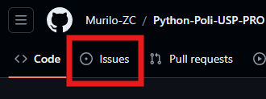
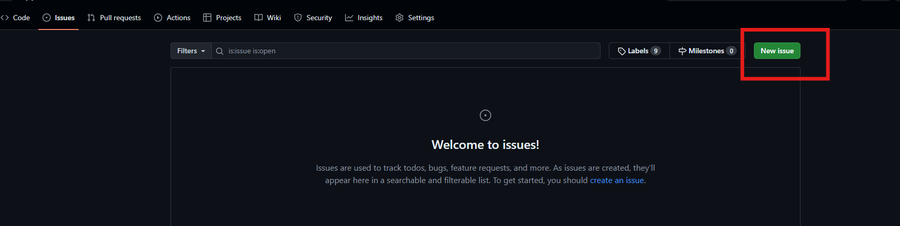
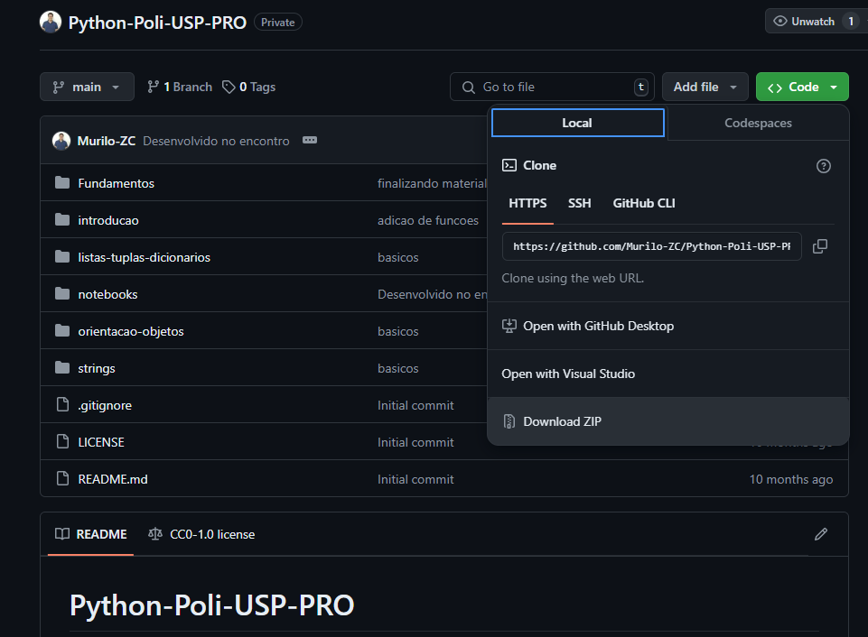

# Python-Poli-USP-PRO

Repositório para armazenar os códigos fonte desenvolvidos durante as aulas. Ele vai armazenar as informações sobre as aulas, os códigos fontes e os exercícios propostos.
Eventuais reposições vamos adicionar aqui também. Qualquer dúvida pessoal, adicionar ela como uma `Issue` no repositório.
Para adicionar essa `Issue`, basta clicar no botão `Issues` e depois em `New Issue`.





Agora adicionar os detalhes do problema que você está enfrentando e clicar em `Submit new issue`. Tente adicionar o máximo de detalhes possíveis para que possamos te ajudar da melhor forma possível.


## Estrutura do Repositório

O repositório está dividido em 2 pastas principais:

- `Parte 01`: Contém os códigos fontes desenvolvidos durante a primeira aula, a introdução geral ao Python.
- `Parte 02`: Contém os códigos fontes desenvolvidos durante a segunda aula, a introdução as ferramentas de Data Science com Python.

## Como eu posso baixar os códigos fontes?

Você pode baixar os códigos fontes de duas formas:

1. Clonando o repositório: Para clonar o repositório, você precisa ter o `git` instalado na sua máquina. Caso você não tenha, você pode baixar o `git` [aqui](https://git-scm.com/). Com o `git` instalado, você pode clonar o repositório com o seguinte comando:

```bash
git clone https://github.com/Murilo-ZC/Python-Poli-USP-PRO.git
```

2. Baixando o repositório como um arquivo `.zip`: Você pode baixar o repositório como um arquivo `.zip` clicando no botão `Code` e depois em `Download ZIP`.



Bons estudos! 🚀
